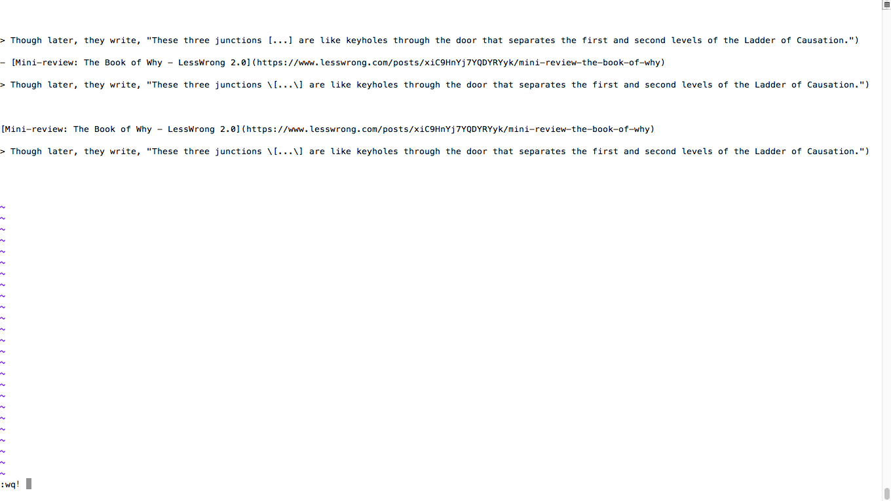

# 10/18/2019

- Firefox add-oon "copy selection as markdown file"(just like the workflow or siri shortcuts in iPad did) does an excellent job here.

`false pic display`

`using markdown spell`

`using html spell`

  
  

